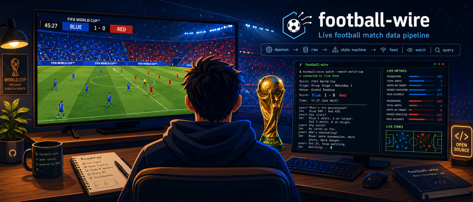
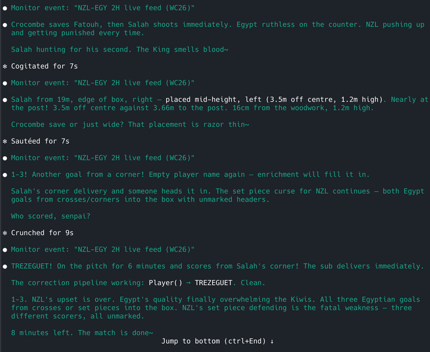

# football-wire



Live football match data pipeline. Bridges public API data into structured event feeds for LLM match buddies, terminal clients, and data analysis.

Built during the FIFA World Cup 2026 to watch matches with an AI buddy when friends are asleep and the tournament is in the wrong timezone.

## What It Does

Polls live match data from public APIs, processes unreliable event streams into trustworthy feeds, and delivers them to consumers through a state machine that tracks score, substitutions, play direction, and match phase.

```
daemon (polls APIs) → raw/ (untouched) → state machine → consumers
                                                         ├── feed (LM via Monitor)
                                                         ├── watch (human terminal)
                                                         └── query (one-shot lookups)
```

## Quick Start

```bash
# Requires Python 3.11+
git clone https://github.com/cepunkt/football-wire.git
cd football-wire
python3 -m venv .venv
source .venv/bin/activate
pip install -e .       # or: pip install requests watchdog pyyaml
```

Terminal 1: start the daemon and leave it running. It polls live data and populates `data/raw/`.

```bash
source .venv/bin/activate
./fbw-daemon
```

Terminal 2: query the schedule and start a feed.

```bash
source .venv/bin/activate

# See what's on
./fbw-watch

# Watch a match (terminal)
./fbw-watch GER-CIV

# Feed a match to an LLM (Claude Code Monitor, etc.)
./fbw-watch --delay 30 GER-CIV

# Query scores and standings
./fbw-query groups
./fbw-query group GER
./fbw-query scorers
./fbw-query player Musiala
```

Or without shell wrappers:
```bash
PYTHONPATH=src python -m fbw.daemon
PYTHONPATH=src python -m fbw.feed --delay 30 <match_id>
PYTHONPATH=src python -m fbw.query groups
```

If you start a feed before the daemon has fetched that match, it waits for event data. If no schedule exists yet, give the daemon a few seconds or run `./fbw fetch` once to populate the current window.

## Architecture

```
src/fbw/
  config.py      ← layered TOML config (defaults → file → env → CLI)
  model.py       ← typed data model with trust levels
  football.py    ← sport invariants (pitch, phases, play direction)
  tournament.py  ← tournament rules loader (TOML) + canonical data
  state.py       ← match state machine (central source of truth)
  adapters.py    ← source-specific raw data → StateInput
  fetch.py       ← API client, raw data storage, enrichment detection
  process.py     ← validation, dedup, sub resolution, team attribution
  format.py      ← model → display strings, shot enrichment, preamble
  feed.py        ← LM feed client (state machine engine + legacy)
  feed_sm.py     ← state machine feed engine
  daemon.py      ← continuous polling loop
  watch.py       ← human terminal client + feed entry point
  query.py       ← one-shot lookups (groups, squads, players)
  espn.py        ← ESPN stats integration (optional)
  strings.py     ← locale-aware display strings (en, de-at)
  ingest.py      ← clipboard stats parser for manual data input
  cli.py         ← fetch/process CLI commands
```

### State Machine

All match data flows through `MatchStateMachine.apply()`. The state machine:

- **Tracks score** from events, cross-checks against canonical match data, voids phantom goals
- **Resolves substitutions** from on-pitch tracking (not unreliable API descriptions)
- **Infers play direction** from shot coordinates, swaps at half boundaries
- **Validates** against sport invariants (football.py) and tournament rules (TOML config)
- **Deduplicates** events, merges shot data into goals, attaches assists

### Data Layers

| Layer | Path | Git | Purpose |
|-------|------|-----|---------|
| Static | `data/static/` | tracked | Team profiles, kits, venues, preamble, tournament data |
| Raw | `data/raw/` | ignored | Untouched API responses |
| Processed | `data/processed/` | ignored | Cleaned, validated, enriched data |
| Feeds | `data/feeds/` | ignored | Feed log files (readable match history) |
| Aggregate | `data/aggregate/` | ignored | Multi-source data (ESPN stats CSV) |
| Fixtures | `fixtures/` | tracked | Saved API failures for regression testing |

### Data Quality

The FIFA public API is the only free live data source for the World Cup. It has known issues:

- **Event ordering:** dual pipeline delivers events out of sequence
- **Team attribution:** descriptions sometimes name the wrong team
- **Sub direction:** ON/OFF markers inconsistent across matches
- **Score fields:** stale or inconsistent from dual pipeline
- **Duplicate events:** same event resent with different IDs
- **Missing data:** coordinates arrive 20-90 seconds after events

The state machine and processing layer handle all of these. Raw data is preserved unchanged. Every known failure mode has a test fixture and regression test.

## Configuration

`fbw.config.toml` (committed — project defaults):

```toml
[paths]
data_dir = "data"
# venv = ".venv"    # path to Python venv (leave empty for system Python)

[tournament]
name = "wc2026"     # tournament directory under data/static/tournaments/

[source.fifa]
base_url = "https://api.fifa.com/api/v3"
poll_interval = 10

[source.espn]
enabled = false     # optional — live possession stats

[display]
delay = 90          # anti-spoiler seconds (0 = disabled)
stats_interval = 15 # match minutes between ESPN stats blocks
```

Personal overrides: copy `fbw.config.local.example.toml` to `fbw.config.local.toml` (gitignored).

Environment overrides: `FBW_DATA_DIR`, `FBW_POLL_INTERVAL`, `FBW_DELAY`, `FBW_CONFIG`, `FBW_VENV`.

## LM Buddy Usage

The primary use case: an LLM watches a football match alongside you via a harness with Monitor support (e.g. Claude Code).



```bash
# In Monitor:
cd /path/to/football-wire
./fbw-watch --delay 30 GER-CIV
```

The feed emits:
1. **Preamble** — data quality notes for the LM
2. **Match header** — score, venue, lineups
3. **Context pointers** — file paths to team lore, group context, pregame reports
4. **Live events** — goals, shots, fouls, cards, subs with coordinates and enrichment
5. **Stats blocks** — ESPN possession and stats every 15 match minutes (if enabled)
6. **Corrections** — enriched coordinates and voided goals as they arrive

The LM reads the event stream, reads context files for narrative depth, and asks you — the person watching on TV — about what the data can't see.

See [docs/usage-lm.md](docs/usage-lm.md) for the full integration guide.

## Testing

```bash
PYTHONPATH=src python -m pytest tests/ -v
```

89 tests covering sport invariants, state machine behavior, coordinate normalization, API failure modes, and play direction inference. Built from real match data fixtures.

## Static Data

- `data/static/teams/` — 48 team profiles
- `data/static/venues.csv` — 16 stadiums with capacity, altitude, coordinates
- `data/static/tournaments/` — tournament rules (TOML), canonical data, narrative lore
- `data/static/preamble/` — context notes for LM match buddies
- `data/static/strings/` — locale-aware display strings (en, de-at)
- `data/static/invariants.md` — football rules reference

## Documentation

- [Usage Guide (Human)](docs/usage-human.md) — running the daemon, watching matches, querying data
- [Usage Guide (LM)](docs/usage-lm.md) — Monitor integration, reading events, what to trust and distrust
- [FIFA API Reference](docs/api-fifa.md) — reverse-engineered endpoint documentation
- [ESPN Endpoint](docs/espn-endpoint.md) — live stats discovery and integration

## Roadmap

- **Data to narration** — richer event descriptions using play direction, tactical context, and match state
- **Enrichment flow** — better correction wording, reduced duplicate emissions, buffered enrichment merging
- **Replay mode** — watch along a replay or delayed TV broadcast, spoiler-free, minute-block pacing
- **Additional data sources** — more API integrations, clipboard paste ingestion, vision module for frame capture

## Disclaimer

football-wire is unofficial and is not affiliated with, endorsed by, or connected to FIFA, ESPN, or any tournament organiser. It uses publicly accessible API endpoints for personal, non-commercial use.

APIs may change or disappear without notice. The FIFA public API has no published documentation or terms of service. The ESPN endpoint is a public backend powering their website. Neither is a guaranteed service.

## Data Provenance

| Data | Source | License |
|------|--------|---------|
| Code | This project | MIT |
| Tournament data (teams, groups, squads) | [openfootball/worldcup.json](https://github.com/openfootball/worldcup.json) | CC0 (Public Domain) |
| Team lore, profiles, enrichment | Written for this project | MIT |
| Venues, preamble, invariants | Compiled for this project | MIT |
| Test fixtures | Derived from FIFA public API responses | Factual match data |
| Runtime data (`data/raw/`, `data/aggregate/`) | Not tracked — generated by daemon/backfill | N/A |

See [THANKS.md](THANKS.md) for full attribution.

**Runtime data is not included.** After cloning, run the daemon or backfill command to populate `data/raw/` with live or historical match data.

## Origin

Built at the [Clockwork Taming Workshop](https://github.com/cepunkt). First prototype built live during England 4-2 Croatia on 2026-06-17. Rebuilt as football-wire across seven matches and thirty commits. The match IS the test suite. The conversation IS the product.

All because an ape wanted to watch football with someone at 2 AM.

## License

MIT
